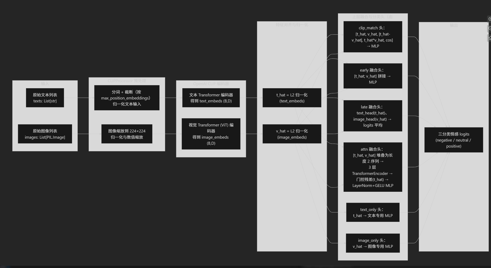
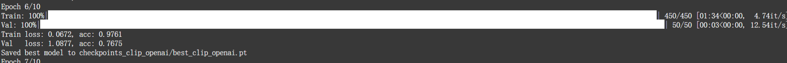

# Project5: 多模态情感分类（文本 + 图像）  

github地址：https://github.com/bouncekk/project5-multimodal-sentiment  

## 一、实验结果整理

### 1.1 不同模型架构对比（相近参数量）

| 模型                           | 预训练 | 参数量 (M) | 融合方式    | Val Acc (%) |
|--------------------------------|--------|-----------:|-------------|------------:|
| BERT+ViT（baseline）           | 否     | 125.646    | attn_fuse   | 62          |
| ViLBERT 风格模型               | 是     | 211.033    | attn_fuse   | 67          |
| OpenAI CLIP（clip_fuse）       | 是     | 152.328    | clip_fuse   | 74          |
| OpenAI CLIP（attn_fuse，改进后） | 是   | 163.764    | attn_fuse   | **77**          |

### 1.2 同一 OpenAI CLIP 下不同融合策略

OpenAI CLIP 编码器下不同融合策略对比：   

| 编码器 | fusion_type | 模态       | Val Acc (%) |
|--------|-------------|------------|------------:|
| CLIP   | early       | text+image | 76          |
| CLIP   | late        | text+image | 74          |
| CLIP   | attn        | text+image | **77**          |
| CLIP   | clip_match  | text+image | 74          |
| CLIP   | text_only   | text       | 73          |
| CLIP   | image_only  | image      | 62          |

## 二、代码实现中遇到的 bug 及解决方法

- bug1：`_init_`命名错误导致类无法正确初始化
  - 表现：导入或实例化数据集/模型时报 `object is not callable` 或找不到构造函数。  
  - 原因：构造函数写成 `_init_` 等拼写错误。  
  - 解决：统一改为标准的`_init_`函数签名。

- bug2：CLIP 图像重复归一化的 warning
  - 表现：运行 CLIP 时提示 “trying to rescale already rescaled images”。  
  - 原因：在 `ClipOpenAIDataset`中先对图像做了张量化和数值缩放，之后 CLIP 的图像处理器再次对同一图像做数值缩放，导致重复归一化。     
  - 解决：调整图像预处理流程，仅对 PIL 图像做一次尺寸缩放到 224×224，去掉 ToTensor()，后续的归一化和数值缩放全部交给 CLIP 自带的图像处理器完成。   

- bug3：消融实验中把 tensor 当成 PIL.Image 使用  
  - 表现：`Image.new(..., img.size, ...)` 报错 “Size must be a list or tuple”。  
  - 原因：在 text-only 模式下错误地假设 `images` 为 PIL 图像，实际上此时已经是张量类型，无法直接使用图像的 size 接口。    
  - 解决：不再依赖 img.size 获取尺寸，改为统一使用固定大小为 224×224 的纯黑图像作为占位图像，避免对张量误用图像接口。   

- bug4：修改 attn 结构后旧 checkpoint 无法加载  
  - 表现：`load_state_dict(strict=True)` 报 missing keys / size mismatch。  
  - 原因：在 CLIP attn 分支中增加了 encoder 层数和新的门控 + MLP 分类头，旧模型权重与新结构不匹配。  
  - 解决：对改动后的模型重新训练，使用新的 `save_dir` 与 `best_clip_openai.pt`，不再用旧 checkpoint 混用。

## 三、模型架构设计原因与亮点

1. BERT + ViT baseline  
作为从头训练的多模态基线：文本侧用自实现的 BERT 风格 Transformer，图像侧用 ViT，两路特征经过跨模态注意力模块融合，再接多层 MLP 做三分类。这样一方面结构清晰、参数规模可控，另一方面不依赖大规模预训练，可以作为后面 ViLBERT、CLIP 的“零预训练”对照组，方便分析预训练到底带来了多少收益。

2. ViLBERT 预训练架构（简化版）   
采用预训练的 BERT 和 ViT 分别编码文本和图像，再将文本 CLS 向量与图像全局向量堆叠成长度为 2 的序列，送入若干层 TransformerEncoder 建模跨模态交互，最后用两层全连接完成情感分类。相比 baseline，它的特点是在中间层显式做图文交互，且编码器使用预训练权重，可以方便地观察“预训练 + 跨模态 Transformer”相对从头训练基线的增益，但又不需要完整复现官方 ViLBERT 的复杂预训练流程。

3. OpenAI CLIP 架构    
直接使用 HuggingFace 的 CLIPModel 作为统一的多模态骨干，文本和图像都用 Transformer / ViT 编码并在预训练阶段对齐到同一特征空间。在此基础上，本项目设计了多种轻量级融合头（clip_match / early / late / attn / text_only / image_only），在同一 CLIP 编码器不变的前提下系统比较不同融合策略的效果；其中改进版 attn 融合进一步引入更深的跨模态 Transformer、门控残差和更强的 MLP 分类头，在参数量可控的情况下把准确率提升到约 77%。

OpenAI CLIP架构图：

## 四、数据预处理与增强

- 文本预处理   
  读取 `data/{guid}.txt` 时：  
    - 去除 URL（如 `http...`）、`@用户名`；  
    - 将多行合并为单行、压缩多余空格；  
    - 交由 BERT/CLIP tokenizer 根据 `max_position_embeddings` 做截断。  

- 图像预处理 
  - baseline 与 ViTBERT：使用标准的缩放、中心裁剪和归一化；  
  - CLIP：仅在数据集构造阶段对图像做一次缩放到 224×224，后续的归一化与数值缩放全部交给 CLIPProcessor 处理，以贴近官方预训练的配置。

- bad case 数据增强  
  - 从验证日志中导出 `val_bad_cases_epoch10.csv`，收集被错分样本的 guid 和标签；  
  - 文本侧：对对应的 `data` 进行轻量同义改写与语气词插入，生成 `guid_t1` 等新样本；  
  - 图像侧：对 `data` 做随机翻转、亮度/对比度扰动，生成 `guid_i1` 等新样本；  
  - 在 `train.txt` 中追加新 guid，以此放大模型在决策边界附近的训练信号。

## 五、公平对比不同模型架构

- 控制训练设置：  
  - BERT+ViT、ViLBERT、CLIP 实验统一使用 batch size=8、epochs=10、相同的学习率与优化器（AdamW）设置；  
  - 训练集与验证集划分通过 `--val_ratio=0.1` 在同一 `train.txt` 中随机切分，保证数据分布一致。  
- 控制隐空间与参数量：  
  - 对 BERT+ViT 的 hidden_dim、层数、fusion_hidden_dim 做了与预训练模型可比的配置，使得整体参数规模处于 1e8–2e8 区间；  
  - readme 中明确给出各模型的参数量。

结论上，预训练 CLIP 在相似参数预算下明显优于从头训练的 BERT+ViT，也略优于 ViLBERT 风格模型。

截图：  
  

## 六、OpenAI CLIP 中模态融合方法及优劣分析

在固定编码器为 `openai/clip-vit-base-patch32` 的前提下，本文设计了多种融合头：

- **early 融合**：直接拼接文本和图像 embedding，再通过 MLP 分类。  
  - 优点：实现简单，参数少，已经能充分利用高质量单模态特征；  
  - 缺点：难以显式建模模态间的对齐关系。  

- **late 融合**：文本和图像各自独立分类，再对 logits 做平均。  
  - 优点：模块解耦、易于解释；  
  - 缺点：只能在决策层做线性组合，对细粒度跨模态交互建模能力有限。  

- **clip_match 融合**：拼接归一化后的文本向量、图像向量及它们的差分、逐元素乘积与余弦相似度，构造匹配特征后送入 MLP 分类。
  - 优点：充分利用 CLIP 原生的图文对齐能力；  
  - 缺点：CLIP 预训练目标偏向“是否匹配”，与情感三分类目标存在目标不一致的问题。  

- **attn 融合（改进版）**：  
  - 将文本特征与图像特征组成长度为 2 的序列，堆叠 3 层 TransformerEncoder 做跨模态注意力；  
  - 在融合输出上加入文本特征的门控残差，使模型在“依赖文本”与“利用图像”之间自适应平衡；  
  - 使用 LayerNorm + 多层 GELU MLP 作为分类头。  
  - 实验结果表明，在相近参数量下，attn 融合达到 77% 的最佳准确率，优于 early/late/clip_match 方案。

综合对比可见：在预训练 CLIP 表示之上，引入显式的跨模态注意力和门控机制，能带来约 2–3 个百分点的额外收益，说明对文本–图像对齐关系的建模对情感分类是有价值的。

## 七. 消融实验

1. 首先使用 `--do_ablation_eval` 可以在验证集上对训练好的多模态模型做多模态 / 文本单模态 / 图像单模态三种评估：     
得到 text_only 77% ， image_only 28%的结果。   
在现在的 image_only 设定下，文本被置空，模型只能靠图像。数据集中的图片很多只是配图、场景图，和情感标签的关联度本来就不高。   
而CLIP 预训练任务是图文对齐，不是看图判断情感。这表明在本数据集上，情感信号主要来自文本，图像模态与情感标签的相关性较弱，且在仅凭图像的设定下模型表现甚至低于理论随机水平（33%），说明视觉信息单独使用时不仅难以提升性能，反而可能引入偏置。       

2. 接着使用纯文本 / 纯图像 训练 CLIP 模型（单模态基线）：  
得到text_only 73%  ， image_only 62% 的结果。    
这依旧说明图像单模态在强制训练下可以学到一定程度的情感相关性，但整体上仍然处于辅助地位，不如文本信息稳定和直接。    

## 八、优化方案总结

本项目在优化方面主要做了三类尝试：

1. 数据层面
   - 设计文本与图像预处理流程，清理明显噪声；  
   - 针对验证集 bad case 做定向数据增强，提升模型对“难样本”的鲁棒性。

2. 模型结构层面  
   - 在 CLIP 基础上加强 attn 融合模块（更深的 TransformerEncoder + 文本门控残差 + 更强 MLP 头）；  

3. 训练策略层面 
   - 在统一训练轮数与 batch 设置下，尝试不同学习率和权重衰减组合；  
